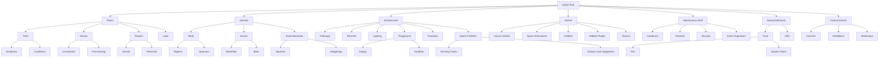

This text is optional and is not rendered.
Only a single `mermaid` block is allowed in each `.md` file.
This diagram is created by https://claude.ai for example purposes.

```mermaid
graph TD
    A[Urban Park] --> B[Plants]
    A --> C[Animals]
    A --> D[Infrastructure]
    A --> E[Visitors]
    A --> F[Maintenance Staff]
    A --> W[Natural Elements]
    A --> X[Cultural Events]

    B --> G[Trees]
    B --> H[Shrubs]
    B --> I[Flowers]
    B --> J[Lawn]
    G --> G1[Deciduous]
    G --> G2[Coniferous]
    H --> H1[Ornamental]
    H --> H2[Fruit-bearing]
    I --> I1[Annual]
    I --> I2[Perennial]

    C --> K[Birds]
    C --> L[Insects]
    C --> M[Small Mammals]
    K --> K1[Pigeons]
    K --> K2[Sparrows]
    L --> L1[Butterflies]
    L --> L2[Bees]
    M --> M1[Squirrels]
    M --> M2[Hedgehogs]

    D --> N[Pathways]
    D --> O[Benches]
    D --> P[Lighting]
    D --> Q[Playground]
    D --> D1[Fountains]
    D --> D2[Sports Facilities]
    Q --> Q1[Swings]
    Q --> Q2[Sandbox]
    D2 --> D21[Running Tracks]
    D2 --> D22[Outdoor Gym Equipment]

    E --> R[Leisure Visitors]
    E --> S[Sports Enthusiasts]
    E --> T[Children]
    E --> E1[Elderly People]
    E --> E2[Tourists]

    F --> U[Gardeners]
    F --> V[Cleaners]
    F --> F1[Security]
    F --> F2[Event Organizers]

    W --> W1[Pond]
    W --> W2[Hills]
    W1 --> W11[Fish]
    W1 --> W12[Aquatic Plants]

    X --> X1[Concerts]
    X --> X2[Exhibitions]
    X --> X3[Workshops]
```
